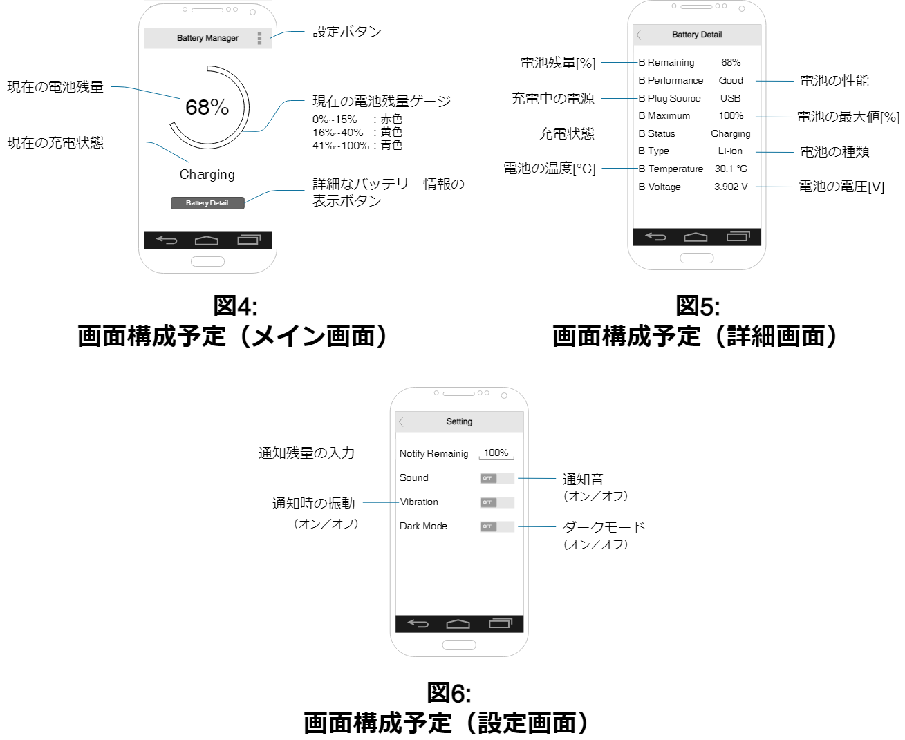
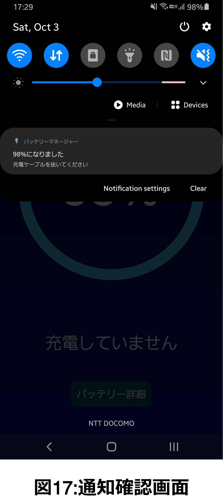

# バッテリーマネージャー

## アプリ概要図

[slide.pdf](./ReadmeImg/slide.pdf)

## アプリ概要

本アプリで最も注目するべき点は，充電中にユーザが指定した充電残量（以下，通知残量という）に達すると通知を発行し，ユーザに知らせる点である．もちろん，通知残量は変更が可能であり，必ずしも100%に設定する必要はない．

アプリのメイン画面（図1）では充電残量が青色の円形に可視化され，通知残量は緑色の円で表示される．なお，充電中は充電完了までにかかるおおよその時間が表示される．

メイン画面下方の「バッテリー詳細」ボタンから遷移するバッテリー詳細画面（図2）では，現在の充電残量に加えて，現在のバッテリーの性能，充電電源の種類，バッテリーの温度など，合計8個のバッテリーに関する情報が確認できるようになっている．

先述の通知残量の変更は設定画面（図3）にて変更する．ここでは，通知残量の変更に加えて，通知音や通知時の振動の有無を設定したり，アプリ全体のテーマを暗くしたりすることができる「ダークモード」の機能も搭載している．なお，以下の図1～3はダークモードをオンにした状態のときの図である．

## 要求分析

私はスマートフォンの充電を開始するとそのまま放置し，忘れてしまうことが多いことに気づいた．諸説あるが，一般的に充電残量が100%の状態で充電を長時間続けてしまうと，多くのスマートフォンに搭載されているリチウムイオン電池は過充電と呼ばれる状態に陥り，バッテリーの寿命が格段に短くなってしまうと言われている．そのため，バッテリーの残量が指定の量だけ充電されるとユーザに知らせる機能が必要だと考えた．ユーザ自身が通知残量を設定できることについて，単純に過充電を防ぐ目的であれば通知残量を100%に固定すればよい．しかし，バッテリーを長持ちさせるためには一般的に20%～80%の充電残量を維持することが最良であるとされていることから，通知残量の設定はユーザ自身に委ねるべきだと考えた．

ユーザに通知する機能の他にも，バッテリー関連を扱うアプリケーションとして現在の充電残量はもちろん，充電完了までにかかる時間やバッテリーの温度など，さまざまなバッテリーに関する情報を確認できる機能も必要だと考えた．なお，充電残量は数値表示だけではなく，視覚的に確認できるゲージを設けた方が良いと考えた．

## 外部設計

### 画面設計と機能設計

本アプリの基本的な機能である充電残量や充電完了までの時間の取得はAndroid側で用意されている`BatteryManager`クラスを使用することで実装できる．その他，バッテリー詳細画面に表示する情報のすべてもこのクラスから取得できる情報である．

一方，自ら実装しなければならない機能は主に設定画面に多く存在し，例えば設定項目の保存である．Androidアプリ上で設定情報を保存するためには`Preference`ライブラリを使用する必要があり，データの保存や読込みなどの処理を実装しなければならない．また，テーマの切替えについては，`res`フォルダにある`styles.xml`ファイルにダークモードがオンまたはオフであるときのデザインを定義しておく必要がある．なお，スイッチによるリアルタイムのテーマ変更は設定画面のアクティビティをアニメーション無しで再度呼び出すことで実現し，それと同時にAndroid Manifestでアプリ全体のテーマを上書きすることで他のアクティビティのテーマも変更される．通知の機能についてはAPIレベルが25以下であれば通知音の種類や振動パターンの変更，さらにそれらのオン・オフの実装が容易にできる．しかし，APIレベル26以上では通知の仕様が異なり，アプリインストール後に通知に関する再設定ができなくなっている．そのため，APIレベル26以上の端末ではそれらの設定を表示しないようにしている．

## 内部設計

### 内部データ

|データ名        |型       |初期値 |
|----------------|---------|-------|
|通知残量        |`int`    |100    |
|ダークモード有無|`boolean`|`false`|
|通知音有無      |`boolean`|`false`|
|振動有無        |`boolean`|`false`|

これらのデータは`Preference`ライブラリによって端末に記録され，アプリ再起動後も保持されている．

### クラス図とフローチャート

## 実行画面

以下に示すそれぞれのシーンにおける実行画面はすべて「Galaxy S9+」での画面であり，アプリのテーマはダークモードにしている．なお，APIレベル25以下のスマートフォンとしては「Xperia Z5」を採用している．

### メイン画面

メイン画面では現在の充電残量を数値と円形のゲージで示しており，他にも現在の充電状態やバッテリー詳細シーンに遷移するボタンも用意してある．下図の画面はそれぞれ図9が充電をしていないとき，図10が充電をしているときの画面である．画面中央の円形ゲージには青色の充電残量に加え，緑色の通知残量も表示されている．このときの通知残量は98%であったため，緑色のゲージは98%まで表示されている．なお，残りの白色のゲージは円形ゲージのベースとなる色である．また，充電残量を示す青色のゲージは，残量が40%以下であれば黄色（図11），15%以下であれば赤色（図12）に変化し，充電残量が少ないことをユーザに視覚的に伝える．

### バッテリー詳細画面

バッテリー詳細画面ではバッテリーの性能やバッテリーの温度をはじめとする，さまざまな情報が表示される．特にバッテリーの温度はバッテリーを長持ちさせるために頻繁に確認する重要項目と言えるだろう．また，Galaxy S9+は画面が縦に長いため表示されているデータ数が少ないように見えるが，Xperia Z5での画面ではこのデータ数が適当であった．

### 設定画面

設定画面では通知残量の変更や通知音有無，振動有無やダークモード有無についての設定が可能である．下図に示す画面はそれぞれ図15がAPIレベルが25以下の場合の画面，図16がAPIレベルが26以上の場合の画面である．APIレベルによって表示される内容が異なる理由は「**外部設計**」にて記載した通り，Androidの通知の仕様が異なるためである．

### 通知の確認

この画面はアプリの画面ではなく，スマートフォンの画面を上から下にスワイプして表示される通知一覧画面である．画面中央に表示されている通知が本アプリからの通知である．なお，通知は充電残量が通知残量に到達した旨を伝える通知内容となっている．また，APIレベル26以上であれば通知の重要度を指定することができるが，今回は重要度を`DEFAULT`としているため，ユーザ自身が通知を削除することができる．

### ダークモードオフ画面

これまでの実行画面はすべてダークモードをオンにした画面であった．以下に示すのはダークモードをオフにしたときのそれぞれのシーンの画面である．

